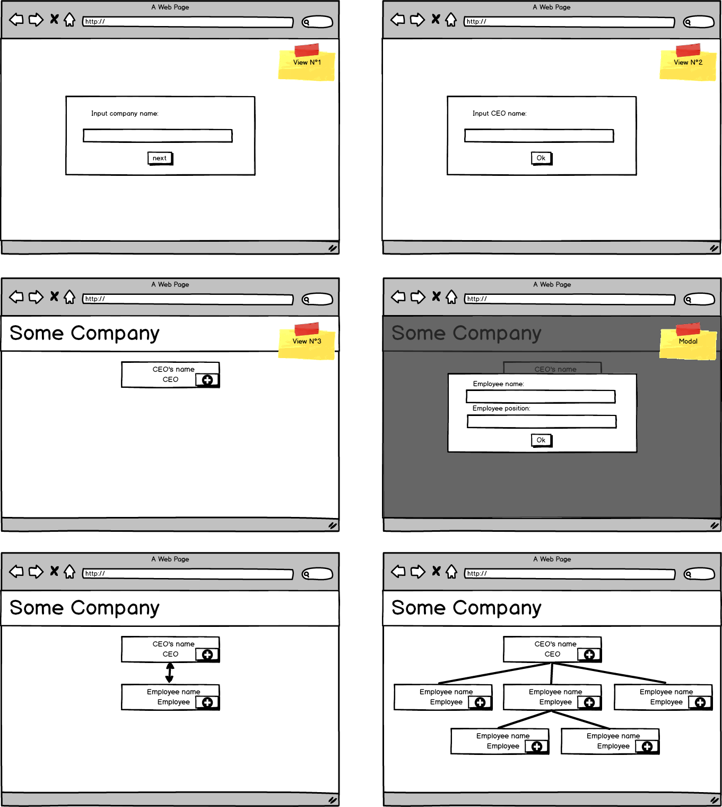

# Testing & Patterns Extended Project

Create a **Organization Chart** application using _React_.

## Requirements

- [ ] The user should be prompted to write Company Name the first time it access the application.
- [ ] The user should have a form to add the CEO of the company.
- [ ] The user should have options to add one or more subordinates to each employee starting by the CEO.
  - [ ] When deciding to add a subordinates a form should appear to ask the user for the person name.
- [ ] _Optional_: The whole Organization Chart should be stored in localStorage and reused when the user access the application again.
- [ ] _Optional_: Ask for the employee title inside the application.
- [ ] _Optional_: Create a select with all the possible titles and use it to highlight employees with the selected title.

## Acceptance Criteria

- [ ] It must use semantic HTML
- [ ] It must use React
- [ ] It must be Responsive
- [ ] It must use CSS in JS
- [ ] It must have tests
- [ ] It must pass with green the Accessibility tests of the Chrome Audits
- [ ] It must pass with green the Best Practices tests of the Chrome Audits
- [ ] It must pass with green the SEO tests of the Chrome Audits

## Contributors

- Carlos Ayala
- Mayra Navarro
- Deyvi Conde
- Ricardo Yrupailla
- Diego Cuevas

This project was bootstrapped with [Create React App](https://github.com/facebook/create-react-app).

## Installation

```
npm install
```

or

```
yarn install
```

## Tests

```
npm run test
```

or

```
yarn test
```

In case of message error, this command might be required:

```
echo fs.inotify.max_user_watches=524288 | sudo tee -a /etc/sysctl.conf && sudo sysctl -p
```

## Execution

```
npm start
```

or 

```
yarn start
```

## Views



## Object

### Collaborators

```
{
  id: number,
  name: string,
  position: string,
  parent: number,
  children: [number, number, ...],
}
```
